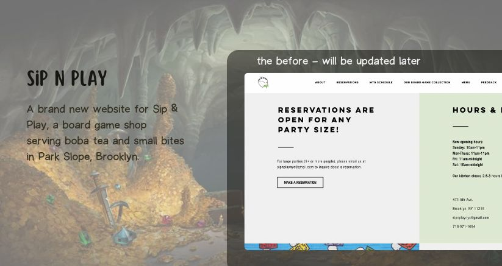

<br>

## 🛡 Index
- [🗝️ Key Features](#-key-features)
- [⚔️ Technologies Used](#-technologies-used)
- [🚪 Key Directories and Files](#-key-directories-and-files)
- [## 🖥️ Installation](#️-installation)
- [⚜ Usage](#-usage)
- [🏰 Process](#-process)
- [👑 Challenges](#-challenges)
- [🎯 Future Plans](#-future-plans)
- [📜 File Structure](#-file-structure)

<br>

## 🗝️ Key Features
- **Dark Mode**: Toggle between light and dark themes.
- **Responsive Design**: Adapts to various screen sizes.
- **Interactive 3D Models**: Embedded 3D models using Three.js.
- **Search Functionality**: Search bar for finding board games.
- **Calendar Integration**: Calendar to view upcoming events.
- **Dynamic Pages**: Multiple dynamic pages (Home, Board Games, Calendar, Menu, Press).

## ⚔️ Technologies Used
- SCSS
- Typescript
- React
- React Three Fiber & React Three drei
- Vite
- Blender

### 🚪 Key Directories and Files

- **public**: Static assets like SVGs.
- **src**: Source code directory.
  - **assets**: Images, icons, and branding assets.
  - **components/R3FCanvas**: 3D canvas component.
  - **context**: Context providers for state management.
  - **features**: Modular feature components (board games, calendar, home, menu).
  - **hooks**: Custom React hooks.
  - **layouts**: Layout components including footer and navbar.
  - **pages**: Page components for different routes.
  - **routes**: Route definitions.
  - **styles**: SCSS styles organized by abstracts, base, components, and themes.
  - **utils**: Utility functions and constants.
  - **App.tsx**: Main app component.
  - **main.tsx**: Entry point of the application.
- **config files**: Configuration files for TypeScript, Vite, ESLint, etc.


## 🖥️ Installation

To set up the project locally, follow these steps:

1. **Clone the repository**:

   ```bash
   git clone https://github.com/yourusername/sipnplay.git
   cd sipnplay
   ```

2. **Install dependencies**:

   ```bash
   npm install
   ```

3. **Start the development server**:

   ```bash
   npm run dev
   ```

## ⚜ Usage
### Running the Project

To run the project, use the following command:

```bash
npm run dev
```

Open your browser and navigate to `http://localhost:3000` to see the application in action.

### Building for Production

To build the project for production, use the command:

```bash
npm run build
```

The production-ready files will be generated in the `dist` directory.

## 🏰 Process
Initially, we must implement foundational features (FF) and add calendar content to enhance user functionality. Ensuring compliance with licensing and updating the README.md file, alongside creating an image folder for documentation purposes, are crucial early steps. Next, installing and implementing SASS and a CSS reset helps in maintaining consistent and manageable styling throughout the project.

The creation of the page layout sets the structural foundation, followed by implementing routes and pages to ensure seamless navigation. Developing the navbar and incorporating a responsive mixin allows for a dynamic and adaptable user interface. Establishing default sizes for padding, gaps, margins, and typography, as well as adding a default color scheme, lays the groundwork for a cohesive design.

Styling the navbar and creating a hook for the navbar buttons enhance interactivity and user experience. Adjusting the logo color to accommodate dark mode, and implementing dark mode itself, are essential for modern design standards. Organizing the folder structure keeps the project maintainable and scalable.

Integrating dependencies such as React-three Fiber and Drei facilitates advanced 3D graphics capabilities, which is vital for the visual appeal of a board game store website. Fixing folder inconsistencies ensures a clean and organized codebase.

Creating specific pages like the calendar and implementing board game functionalities enriches the site’s content. Developing the home screen and menu page, followed by extensive color modifications, helps in achieving the desired aesthetic.

Making the website more SEO-friendly improves visibility and search engine ranking, while addressing inconsistent naming conventions and enhances code readability and maintenance. Adding a footer and creating a user interface for the menu page contribute to a complete and user-friendly site. Finally, modifying the home page, adding default background colors, completing the menu, and incorporating chess pieces on the home screen round off the development process, resulting in a polished and engaging website.

## 👑 Challenges
- Initial idea:
	A 3D tablet on a desk with a board game and the menu would "pop up" from the tablet and have interactive 3D items when you scroll through the menu.
	A 3D notice board for the home page with post-its with main information like hours & location, how it works. 
    We're trying to work with warm colors like orange and yellow, but we couldn't find a color palette that the group liked. 
- How we work on these challenges:
    We used 3D models on the home page in a way that would attract attention, but that would work on cell phone browsers, as the bulletin board didn't work on Safari.
    We ended up doing the same for the menu, as the table with the tablet was causing incompatibility on the mobile device, and the focus was on creating an interface that operates on both the monitor and the mobile.
    We ended up opting for a warm color, but towards pastel.

## 🎯 Future Plans
- 

## 📜 File Structure
```
.
├── img-readme
│   └── sipnplay-readme.jpg
├── public
│   └── vite.svg
├── src
│   ├── assets
│   │   ├── brand
│   │   │   ├── sipnplay-dark.svg
│   │   │   └── sipnplay.svg
│   │   └── icons
│   │       ├── facebook.svg
│   │       ├── instagram.svg
│   │       ├── moon.svg
│   │       ├── phone.svg
│   │       ├── sun-mobile.svg
│   │       └── sun.svg
│   ├── components/R3FCanvas
│   │   ├── R3FCanvas.module.scss
│   │   ├── R3FCanvas.tsx
│   │   └── R3FCanvas.types.ts
│   ├── context
│   │   ├── DarkModeContext.tsx
│   │   └── darkModeContext.types.ts
│   ├── features
│   │   ├── board-games
│   │   │   ├── components
│   │   │   │   ├── BoardGames.tsx
│   │   │   │   └── SearchBar.tsx
│   │   │   ├── boardGames.module.scss
│   │   │   └── BoardGames.tsx
│   │   ├── calendar
│   │   │   ├── components
│   │   │   │   └── CalendarItem.tsx
│   │   │   ├── calendar.module.scss
│   │   │   ├── Calendar.tsx
│   │   │   └── Calendar.types.ts
│   │   ├── Home
│   │   │   ├── components
│   │   │   │   └── HomeInfo.tsx
│   │   │   ├── home.module.scss
│   │   │   └── Home.tsx
│   │   └── Menu
│   │       ├── assets
│   │       │   └── CoffeeCup.glb
│   │       ├── model
│   │       │   └── CoffeeCup.tsx
│   │       ├── menu.module.scss
│   │       └── Menu.tsx
│   ├── hooks
│   │   └── useLocalStorageState.tsx
│   ├── layouts
│   │   └── footer
│   │       ├── footer.module.scss
│   │       ├── Fotter.tsx
│   │       ├── layout
│   │       │   ├── layout.module.scss
│   │       │   └── Layout.tsx
│   │       ├── navbar
│   │       │   └── components
│   │       │       └── DarkModeToggle.tsx
│   │       └── hooks
│   │           ├── useToggleMenu.tsx
│   │           ├── navbar.module.scss
│   │           └── Navbar.tsx
│   ├── pages
│   │   ├── BoardGamesPage.tsx
│   │   ├── CalendarPage.tsx
│   │   ├── GiftCardsPage.tsx
│   │   ├── HomePage.tsx
│   │   ├── MenuPage.tsx
│   │   └── PressPage.tsx
│   ├── routes
│   │   └── Routes.tsx
│   ├── styles
│   │   ├── abstracts
│   │   │   └── _mixins.scss
│   │   ├── base
│   │   │   ├── _base.scss
│   │   │   ├── _reset.scss
│   │   │   ├── _sizes.scss
│   │   │   └── _typography.scss
│   │   ├── components
│   │   │   └── _button.scss
│   │   ├── themes
│   │   │   ├── _dark.scss
│   │   │   └── _light.scss
│   │   └── main.scss
│   ├── utils
│   │   ├── constants.ts
│   │   ├── functions.ts
│   │   └── functions.types.ts
│   ├── App.tsx
│   ├── main.tsx
│   └── vite-env.d.ts
├── .eslintrc.cjs
├── .gitignore
├── index.html
├── LICENSE
├── package-lock.json
├── README.md
├── tsconfig.app.json
├── tsconfig.json
├── tsconfig.node.json
└── vite.config.ts
```

## License

This project is licensed under the MIT License. See the [LICENSE](LICENSE) file for details.
